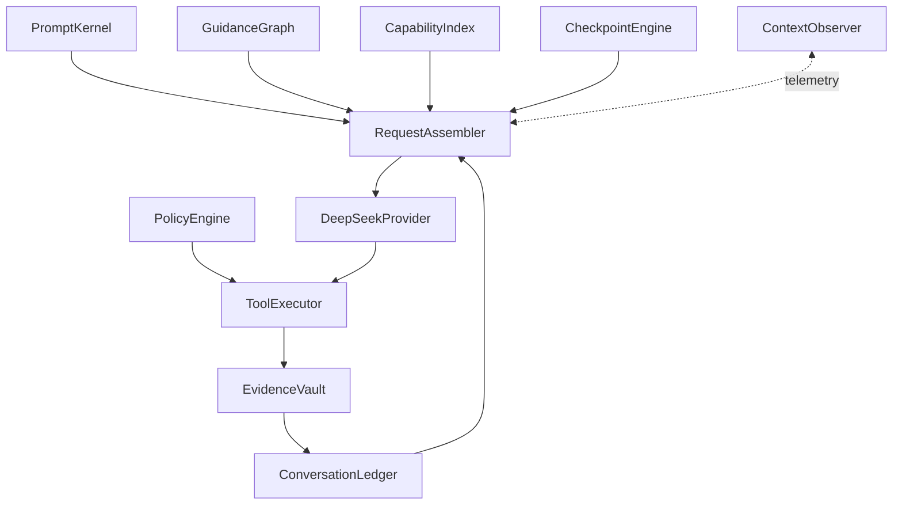

# ADR 003: DeepSeeker Context Operating System

## Status

Accepted

This document incorporates and supersedes the former ADR 002, "Layered Prompt and Context Engineering". The provider-neutral context ledger, evidence reduction, prompt blueprints, persistence, and migration decisions from ADR 002 are maintained here alongside the definitive request layout, role assignment, path-rule activation, memory, capability, compaction, and observability rules. ADR 002 was removed so these contracts have one maintenance source.

## Purpose

DeepSeeker needs a context system that can support long-running coding work without turning every model request into an ever-growing prompt dump. The system must:

- preserve DeepSeek prefix-cache hits;
- keep tool-call trajectories valid across model requests;
- make project guidance scoped, inspectable, and safe;
- keep Runtime facts separate from user intent;
- recover after compaction, interruption, restart, and provider failure;
- avoid treating model reasoning as durable memory;
- expose enough telemetry to explain why every context item was loaded.

The goal is not to copy the visible context list from another product. The goal is to build a context operating system with explicit ownership, ordering, trust, lifetime, and eviction rules.

## Non-goals

- This document does not redesign the public `WorkspaceSession -> WorkCycle -> ActivityUnit -> AgentSignal` protocol.
- This document does not make project guidance a hard security boundary.
- This document does not require the frontend to display raw model reasoning.
- This document does not inject the current plan or workspace delta on every model request.
- This document does not duplicate tool schemas inside `messages`.

## Design principles

1. Stable content goes first; dynamic content is append-only at the tail.
2. The Runtime owns facts, permissions, persistence, and evidence; the model owns semantic planning and implementation decisions.
3. Project files are context, not platform authority.
4. Guidance is a soft instruction; policy is a hard Runtime decision.
5. Tool calls and tool results are an indivisible trajectory.
6. Ordinary reasoning is ephemeral; only provider-required tool continuation reasoning is retained.
7. Compaction preserves authoritative facts deterministically and semantic context selectively.
8. Every loaded context item has provenance, a reason, a token cost, a trust class, and an expiry rule.
9. A 1M context window is capacity, not a target. Relevance remains more important than volume.

## Competitive conclusions

DeepSeeker adopts the following useful ideas:

- Codex-style directory-scoped project guidance, with deeper guidance applying to a narrower subtree.
- Claude Code-style progressive disclosure for path guidance, skills, and long-tail tools.
- Claude Code-style context visibility, including startup cost and compaction survival.
- Codex-style evidence-driven completion and deterministic execution policy.
- Provider-native tool calls instead of text, XML, or DSML tool protocols.

DeepSeeker intentionally does not adopt:

- unrestricted free-form auto-memory injected into every session;
- rebuilding the front of the prompt whenever a path rule activates;
- promoting repository content to platform-level system authority;
- continuously injecting current plan, diff totals, or work status;
- relying on a model-only compaction summary as the source of truth;
- loading every MCP tool schema or full skill body before the user asks anything.

## Architecture



### PromptKernel

Owns the single stable `system` message:

- product identity;
- instruction hierarchy;
- Agent Loop behavior;
- structured tool-call requirements;
- evidence and truthfulness requirements;
- plan-tool policy;
- final-answer policy;
- protocol repair behavior;
- rules for interpreting tagged context envelopes.

PromptKernel must not contain project paths, current plan state, workspace deltas, approval state, recovery state, or session-specific facts.

### GuidanceGraph

Resolves soft instructions from user and project sources. A guidance unit uses DeepSeeker-owned fields:

```ts
type GuidanceUnit = {
  guidanceId: string;
  origin: "personal" | "workspace" | "project" | "local" | "path";
  trust: "user_owned" | "trusted_project" | "untrusted_project";
  reach: "global" | "project" | "subtree" | "path_pattern";
  selectors: string[];
  loadPolicy: "session_start" | "on_path_access" | "explicit";
  precedenceRank: number;
  sourceFile: string;
  revisionHash: string;
  body: string;
};
```

Broad guidance is rendered before specific guidance. A more specific guidance unit wins only within the area it covers. Security restrictions must not depend on GuidanceGraph; they belong to PolicyEngine.

### CapabilityIndex

Separates capability discovery from full capability payloads:

- core local coding tools use a stable schema set;
- long-tail MCP tools are discoverable through stable meta-tools;
- skill names and concise descriptions may be indexed;
- full skill instructions load only when selected;
- provider tool schemas remain in the top-level `tools` field.

### ConversationLedger

Stores provider-neutral, ordered model history:

- user requests;
- assistant content;
- assistant structured tool calls;
- provider-required continuation reasoning;
- paired tool results;
- activated context updates;
- compaction checkpoints;
- recovery capsules.

It does not persist ordinary final-answer reasoning.

### EvidenceVault

Stores full redacted tool output and artifacts outside the model context. ConversationLedger receives a bounded evidence projection containing status, target, exit code, byte counts, digest, retained head/tail excerpts, and explicit truncation markers.

### CheckpointEngine

Builds recoverable compaction checkpoints from two sources:

- deterministic reducers for plans, files, diffs, tool status, validation, failures, approvals, and unfinished operations;
- a constrained semantic summarizer for objectives, decisions, constraints, and unresolved questions.

The semantic summarizer may explain facts but may not invent authoritative execution state.

### ContextObserver

Records and exposes:

- section order and actual role;
- source file and revision hash;
- loading reason and trust class;
- estimated and provider-reported token cost;
- cache hit and miss tokens;
- stable-prefix hash;
- compaction retention and eviction reason;
- activated path guidance and skill bodies;
- whether an item survives compaction.

## Instruction hierarchy

The PromptKernel defines semantic precedence explicitly:

```text
platform safety and protocol
> latest explicit user request
> personal and trusted project guidance
> compaction checkpoint facts
> curated memory
> tool output and external content
```

All project guidance is soft. A requirement that must never be violated must be represented in PolicyEngine, a Hook, a test, a linter, or CI.

## Provider request contract

Tool definitions are sent outside `messages`:

```ts
type DeepSeekRequest = {
  model: string;
  tools?: DeepSeekToolDefinition[];
  messages: DeepSeekMessage[];
};
```

The exact logical request order is:

```text
top-level tools field
1. system       PromptKernel
2. user         StableSessionEnvelope
3. user         CompactionCheckpoint, if one exists
4. mixed roles  Recent complete conversation and tool trajectories
5. user         Lazy ContextUpdate records at their activation positions
6. user         RecoveryCapsule, only when recovery is required
7. user         LatestUserMessage
```

No ordinary model request may insert dynamic state before an already persisted conversation prefix.

## Role assignment

### `system`

DeepSeeker sends exactly one leading `system` message per request. It contains PromptKernel only.

Repository content is never merged into this message. This avoids granting a cloned repository system-level authority and keeps the longest-lived cache prefix stable.

### Stable session `user` envelope

The first `user` message is a frozen session snapshot:

```xml
<stable_session_context revision="sha256:...">
  <personal_guidance>...</personal_guidance>
  <project_guidance>...</project_guidance>
  <stable_environment>...</stable_environment>
  <memory_index>...</memory_index>
  <capability_index>...</capability_index>
</stable_session_context>
```

Stable environment may include workspace root, operating system, shell family, and application version. It must not include changing Git status, diff totals, active plan state, approval state, or running processes.

The snapshot is frozen for a session. Changes to root guidance take effect on restart, clear, or compaction, rather than rewriting earlier history in place.

### Compaction checkpoint `user` envelope

When old history has been replaced, the checkpoint follows StableSessionEnvelope:

```xml
<compaction_checkpoint through_sequence="...">
  ...structured checkpoint...
</compaction_checkpoint>
```

It uses `user`, not `system`, because it is compressed historical context rather than platform policy. It remains stable until the next compaction.

### Assistant messages

Assistant content is persisted with its original role. When an assistant message requests tools, it includes:

```ts
{
  role: "assistant",
  content: string | null,
  reasoning_content: string,
  tool_calls: ToolCall[]
}
```

`reasoning_content` is retained only when the same assistant message contains `tool_calls` and the active DeepSeek capability requires continuation replay.

### Tool messages

Each tool result immediately follows the assistant tool call group and retains the provider call ID:

```ts
{
  role: "tool",
  tool_call_id: string,
  content: string
}
```

Tool output is evidence, not instruction. It is always bounded and redacted before entering the model request.

### Lazy context update `user` envelope

Path guidance and full skill instructions are appended where they activate:

```xml
<context_update
  kind="path_guidance"
  source=".deepseeker/guidance/backend.md"
  reason="first_matching_path_access"
  revision="sha256:...">
  ...guidance body...
</context_update>
```

It uses `user` because DeepSeek has no `developer` role and because project content must remain below platform authority. The PromptKernel tells the model that this is a context update, not a new end-user request.

### Recovery capsule `user` envelope

RecoveryCapsule is present only for continuation after interruption, failure, process restart, or disconnected streaming:

```xml
<recovery_capsule>
  ...authoritative Runtime facts...
</recovery_capsule>
```

It is placed immediately before LatestUserMessage. Normal turns do not receive it.

### Latest user message

The actual user request is always the last message before model generation. It is never merged into Runtime facts or project guidance.

## Concrete request examples

### First coding turn

```text
tools: stable core agent tools

messages:
system    PromptKernel
user      StableSessionEnvelope
user      "修复登录接口的并发问题"
```

### Tool continuation

```text
system    PromptKernel
user      StableSessionEnvelope
user      original request
assistant content + reasoning_content + tool_calls
tool      paired result
assistant next continuation
```

### Path guidance activation after a read

```text
assistant read_file tool_call
tool      read_file result
user      ContextUpdate(path_guidance)
assistant continues with newly active guidance
```

### Path guidance activation before a mutation

```text
assistant edit_file tool_call
Runtime   detects unseen matching guidance before side effect
tool      returns deferred_guidance_loaded without editing
user      ContextUpdate(path_guidance)
assistant re-evaluates and issues a new edit_file call
Runtime   executes only the new call
```

This preflight prevents the first mutation in a newly scoped directory from bypassing its guidance.

### Recovery turn

```text
system    PromptKernel
user      StableSessionEnvelope
user      CompactionCheckpoint, if present
mixed     recent retained trajectory
user      RecoveryCapsule
user      "继续工作"
```

### Post-compaction turn

```text
system    PromptKernel
user      re-resolved StableSessionEnvelope
user      new CompactionCheckpoint
mixed     recent complete trajectories only
user      LatestUserMessage
```

## Agent state policy

The following state is not injected on every request:

- current plan;
- current plan step;
- changed-file totals;
- workspace delta;
- current run phase;
- completed tool count;
- active approval state;
- running process list.

The model sees plan changes through its own `update_plan` tool calls and results. The Runtime persists and displays them. After compaction or recovery, the authoritative current plan is restored through the checkpoint or recovery capsule.

This avoids duplicate plan maintenance and prevents dynamic state from invalidating earlier cacheable history.

## Guidance loading

### Session-start guidance

The stable snapshot may resolve:

- `~/.deepseeker/GUIDANCE.md`;
- project-root `DEEPSEEKER.md`;
- project-root `.deepseeker/GUIDANCE.md`;
- project-root `DEEPSEEKER.local.md`;
- unscoped Markdown files under `.deepseeker/guidance/`.

The file names remain DeepSeeker-owned and are not required to mirror Codex or Claude Code.

### Path-scoped guidance

Path selectors use parsed YAML frontmatter and a standards-based glob implementation. They are not implemented with ad hoc YAML or regex parsing.

A path-scoped unit activates once per revision at its first relevant access. Its activation is stored as a ConversationLedger record at that point. It is not re-rendered into StableSessionEnvelope and does not rewrite previous messages.

After compaction, CheckpointEngine carries the active workset. GuidanceGraph reactivates only guidance relevant to retained recent trajectories, changed files, pending work, or the next requested target. It does not reactivate every rule ever seen in the session.

## Capability loading

### Interaction lanes

DeepSeeker chooses a request lane before calling the provider:

- `conversation`: no tools for greetings, explanations, and ordinary discussion;
- `agent`: stable core coding tool catalog;
- `recovery`: the same stable agent catalog plus RecoveryCapsule.

Changing lanes may change the top-level `tools` field and therefore may reduce cache reuse. This is an intentional tradeoff to prevent unnecessary tool calls during ordinary conversation.

### Core tools

The agent lane keeps a small stable catalog for filesystem inspection, search, mutation, command execution, plan updates, and approval-safe operations.

### Deferred capabilities

MCP and other long-tail capabilities are discovered through stable meta-tools such as capability search and capability invocation. DeepSeeker does not place hundreds of changing schemas at the front of every request.

### Skills

Small skill indexes may appear in StableSessionEnvelope. Full skill instructions are appended as ContextUpdate only when explicitly selected or confidently routed. Skill content has a per-skill and per-session token budget.

## Memory model

DeepSeeker does not initially adopt unrestricted model-authored free-form auto-memory.

Persistent memory uses curated facts:

```ts
type MemoryFact = {
  memoryId: string;
  category: "preference" | "project_fact" | "workflow" | "known_issue";
  statement: string;
  provenance: string;
  confidence: number;
  createdAt: string;
  lastConfirmedAt: string;
  expiresAt?: string;
  visibility: "personal" | "project";
};
```

StableSessionEnvelope contains only a bounded memory digest or index. Detailed memory is loaded on demand. Secrets, reasoning, transient failures, and unverified model guesses are never stored as memory.

## Compaction policy

The active provider capability defines the effective budget:

```text
effective input budget
= provider context window
- requested maximum output
- protocol reserve
- safety margin

automatic compaction threshold
= effective input budget * configured ratio
```

The default ratio remains 85 percent, but it applies to the effective input budget rather than the raw 1M window.

Compaction must retain:

- the latest user objective and explicit constraints;
- the authoritative plan;
- open tool calls and their paired results;
- recently complete trajectories;
- changed files and true workspace delta;
- validation evidence and exit status;
- failures and interrupted operations;
- pending approvals;
- unresolved questions and next action.

Compaction must remove:

- ordinary reasoning;
- repeated narration;
- superseded plans;
- full command logs already stored in EvidenceVault;
- full file bodies that can be re-read;
- duplicate project guidance;
- stale Runtime progress counters.

## Prefix-cache invariants

1. PromptKernel is immutable within a session.
2. StableSessionEnvelope is immutable until clear, restart, or compaction.
3. Tool schemas remain stable within an agent trajectory.
4. Lazy guidance and skills append at their trigger position.
5. Dynamic state never moves ahead of existing history.
6. RecoveryCapsule appears only immediately before a recovery user request.
7. Compaction intentionally invalidates the conversation prefix but retains the system and, when unchanged, session-context prefix.
8. Cache telemetry uses provider-reported hit and miss tokens as the source of truth.

## Security and trust boundaries

- Project guidance loads only after workspace trust has been established.
- External imports and links require explicit approval before reading.
- Guidance paths are canonicalized and constrained to permitted roots.
- Tool output and repository content are tagged as untrusted data.
- PolicyEngine evaluates permissions before side effects and is never overridden by model text.
- Guidance cannot grant filesystem, network, shell, or browser permissions.
- Context telemetry does not store raw secrets, full reasoning, or complete message bodies.

## Context Inspector requirements

The frontend should provide a user-visible context inspector with two views.

### Before first user input

Display:

- PromptKernel token cost;
- StableSessionEnvelope sections;
- memory digest cost;
- core tool-schema cost;
- deferred capability index cost;
- loaded project guidance sources;
- stable-prefix total and hash.

### During a run

Display:

- appended user, assistant, and tool trajectory cost;
- path guidance activation;
- skill activation;
- evidence truncation;
- cache hit and miss tokens;
- current effective budget;
- compaction threshold;
- what will survive compaction.

The inspector is observability UI. Its data must come from ContextObserver telemetry rather than being reconstructed from rendered chat content.

Category rows default to the actual request-construction order. A user may switch the popover to token-share order through its sort control, but token size must never silently replace protocol order as the default.

## Persistence, compatibility, and migration

The public product protocol remains:

```text
WorkspaceSession -> WorkCycle -> ActivityUnit -> AgentSignal
```

`ContextRecord`, `ProviderMessage`, and provider-native DeepSeek messages remain separate boundaries. Context records and telemetry are private SQLite data; existing AgentSignal JSONL logs remain authoritative for UI replay and are not expanded with private context events.

For a legacy terminal cycle that has no context ledger records, SignalStore projects its user prompt and final response into compatibility records before the next provider request. Native cycles write complete ledger records directly and are never duplicated by migration. Full redacted tool output remains in Runtime-owned EvidenceVault artifacts while bounded projections enter the ledger.

Context telemetry stores roles, section costs, hashes, record keys, retention decisions, truncation facts, compaction estimates, and provider usage. It never stores full reasoning, secrets, or full message bodies. Debug snapshots are opt-in and contain request structure rather than content.

## Accepted implementation

The accepted implementation applies the following changes:

1. Keep `ContextRecord`, provider-neutral messages, evidence projection, prompt blueprint versioning, and telemetry.
2. Replace per-request front-loaded path-rule rendering with append-only ContextUpdate records.
3. Replace the ordinary per-request `Runtime current facts` system message with an optional user-role RecoveryCapsule.
4. Change compaction checkpoint transport from `system` to tagged `user` context.
5. Freeze root guidance for a session and re-resolve it only at explicit lifecycle boundaries.
6. Replace hand-written YAML and glob parsing with maintained parsers.
7. Split deterministic checkpoint facts from constrained semantic summarization.
8. Calibrate token estimates against provider-reported prompt tokens.
9. Add memory curation, capability indexing, deferred tools, and skill activation records.
10. Add Context Inspector endpoints and frontend views based on telemetry.

## Implementation record

### Stage 1: Request contract and regression harness

- Typed context sections and envelope kinds are implemented.
- Exact message ordering, role assignment, prefix stability, and tool pairing are covered by regression tests.
- The public AgentSignal protocol remains compatible.

### Stage 2: GuidanceGraph

- DeepSeeker-owned GuidanceGraph fields and trusted source discovery are implemented.
- YAML frontmatter and glob selectors use maintained libraries.
- Lazy ContextUpdate persistence and mutation preflight are implemented.

### Stage 3: Recovery and compaction

- Normal Runtime-state injection is removed.
- RecoveryCapsule is limited to discontinuities and checkpoints use user-role envelopes.
- Deterministic execution facts and optional constrained provider semantic summaries are stored separately in each checkpoint.

### Stage 4: Progressive capability disclosure

- A small core tool profile, deferred capability search/invocation, lazy skill bodies, and activation telemetry are implemented.

### Stage 5: Curated memory and observability

- Curated MemoryFact persistence, ContextObserver API, pre-input/live visualization, cache efficiency, and compaction status are implemented.

### Stage 6: DeepSeek adaptation evaluation

- Controlled DeepSeek requests validate native streaming, usage, role transport, and structured tool behavior.
- Provider-reported usage continuously calibrates heuristic token estimates.
- Long-run cache and adherence measurements remain operational tuning, without changing this contract.
- Provider-specific behavior remains inside `DeepSeekProvider` and capability metadata.

## Acceptance criteria

- A greeting sends no tools and does not start an Agent Loop.
- Agent requests use a stable core tool catalog.
- Tool schemas are absent from message text.
- Exactly one leading system message contains platform instructions only.
- Stable project guidance is transported as the first user context envelope.
- LatestUserMessage is always the final input message.
- Normal turns contain no injected current plan or workspace delta.
- RecoveryCapsule appears only after a real discontinuity.
- Every assistant tool call has paired tool results before continuation.
- Tool-call reasoning is retained only when required by DeepSeek continuation rules.
- Ordinary reasoning never enters memory or checkpoints.
- A newly activated path rule does not alter the preceding cached prefix.
- A mutation cannot execute before newly matched path guidance is delivered to the model.
- Compaction preserves authoritative plan, changes, validation, failure, and pending work.
- Provider-reported cache hit and miss tokens are visible in telemetry.
- Context Inspector can explain the role, source, cost, trust, load reason, and lifetime of every section.

## References

- DeepSeek API: Context Caching
- DeepSeek API: Thinking Mode and Tool Calls
- DeepSeek API: Models and Pricing
- OpenAI Codex: Custom Instructions with AGENTS.md
- OpenAI Codex: Rules
- Claude Code: Explore the Context Window
- Claude Code: Prompt Caching
- Claude Code: Memory and Path-scoped Rules
